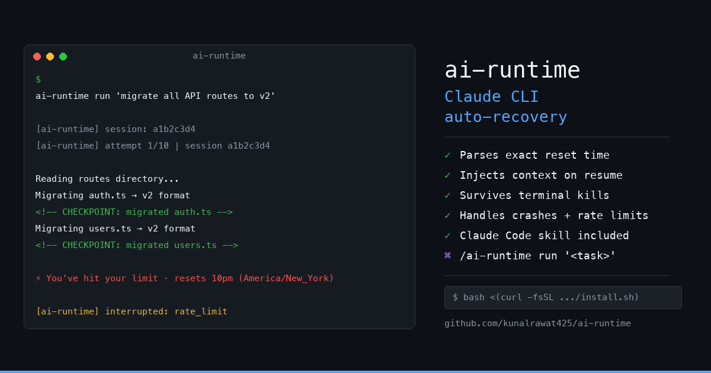

# ai-runtime

**Automatic checkpoint and recovery for Claude CLI.** When Claude hits a rate limit, crashes, or your terminal closes — ai-runtime saves exactly where it was and resumes automatically with full context.

No more restarting from scratch. No more re-explaining what Claude already did.

---

## The problem

Claude hits your usage limit mid-task. You run `claude --continue`. Claude starts over, re-reads the codebase, asks clarifying questions it already answered. You've lost 20 minutes.

`claude-auto-resume` (the bash script people are using) detects the limit and re-runs `--continue`. That's it. No state. No context. Still starts over.

**ai-runtime is the actual fix:**

1. Saves checkpoint after each recovery event (last step, modified files, session ID)
2. Injects a structured "context restored" message directly into Claude's conversation history file before `--continue`
3. Claude sees exactly where it was and keeps going

---

## Install

### Claude Code Marketplace (recommended)

```
/plugin install kunalrawat425/ai-runtime
```

Or search in the marketplace:
```
/plugin marketplace search ai-runtime
```

### Manual (git clone)

```bash
git clone https://github.com/kunalrawat425/ai-runtime.git
cd ai-runtime
bash install.sh          # macOS / Linux
# install.ps1            # Windows (PowerShell)
```

One-liner:
```bash
curl -fsSL https://raw.githubusercontent.com/kunalrawat425/ai-runtime/main/install.sh | bash
```

Installs two things:
- **`ai-runtime` CLI** → `~/.local/bin/ai-runtime`
- **`/ai-runtime` Claude Code skill** → `~/.claude/skills/ai-runtime/`

---

## Usage

### CLI

```bash
# Run a task with auto-recovery
ai-runtime run 'refactor auth.ts to use JWT instead of sessions'

# Run detached — survives terminal close
ai-runtime run 'large migration task' --detach

# See what it's doing (after detach)
ai-runtime attach

# Manually resume the last interrupted session
ai-runtime resume

# Resume a specific session
ai-runtime resume a1b2c3d4

# See all sessions
ai-runtime status

# Auto-recover any interrupted session
ai-runtime recover
```

### Claude Code skill

```
/ai-runtime run 'add dark mode to the settings page'
/ai-runtime status
/ai-runtime resume
```

---

## How it works

```
ai-runtime run 'task'
  │
  ├─ wraps: claude --print '<task + checkpoint instructions>'
  │         monitors stdout for rate limit signals
  │
  ├─ rate limit / crash detected
  │   ├─ saves checkpoint → .ai-runtime/sessions/<id>/checkpoint.json
  │   │   {last_step, files_modified, task_description, timestamp}
  │   │
  │   ├─ finds Claude's conversation history
  │   │   ~/.claude/projects/<slug>/<session-id>.jsonl
  │   │
  │   ├─ appends context restoration message to history file
  │   │   [AI-RUNTIME CONTEXT RESTORED]
  │   │   You were working on: <task>
  │   │   Last completed step: <checkpoint marker or extracted sentence>
  │   │   Files you had modified: <git diff list>
  │   │
  │   ├─ waits for rate limit reset (default: 60 min)
  │   │
  │   └─ runs: claude --continue
  │             Claude reads history → sees restoration message → resumes
  │
  └─ loop until task completes
```

### CHECKPOINT markers (recommended)

ai-runtime instructs Claude to emit markers after each step:

```
<!-- CHECKPOINT: implemented JWT token generation in auth.ts -->
```

These are the most reliable way to extract last step. Without them, ai-runtime falls back to extracting the last prose sentence from Claude's output (~70% accuracy).

---

## Recovery cases

| Event | Recovery |
|---|---|
| Rate limit hit | Detect signal → wait → inject context → `--continue` |
| Process crash | Detect non-zero exit → wait 10s → inject context → `--continue` |
| Ctrl-C (user stop) | Save checkpoint → exit. `ai-runtime resume` to continue. |
| Terminal closed | Use `--detach` mode. Daemon keeps running. `ai-runtime attach` to reconnect. |
| OS restart | `ai-runtime recover` finds last checkpoint → injects context → resumes |

---

## Configuration

| Env var | Default | Description |
|---|---|---|
| `AI_RUNTIME_WAIT_SECONDS` | `3600` | Wait time after rate limit (seconds) |
| `AI_RUNTIME_INSTALL_DIR` | `~/.local/bin` | CLI install directory |

---

## Session files

Checkpoints stored at `.ai-runtime/sessions/<id>/`:

```
checkpoint.json   — task state (last step, files, timestamp)
output.log        — full output log (detached mode)
daemon.pid        — daemon process ID (detached mode)
```

---

## Requirements

- Python 3.8+
- `claude` CLI installed and authenticated
- macOS or Linux

---

## Comparison

| | claude-auto-resume | ai-runtime |
|---|---|---|
| Detects rate limit | ✓ | ✓ |
| Waits for reset | ✓ | ✓ |
| Saves task state | ✗ | ✓ |
| Injects context on resume | ✗ | ✓ |
| Handles crashes | ✗ | ✓ |
| Survives terminal kill | ✗ | ✓ (--detach) |
| CHECKPOINT markers | ✗ | ✓ |
| Claude Code skill | ✗ | ✓ |

---

## License

MIT — [Kunal Rawat](https://github.com/kunalrawat425)
